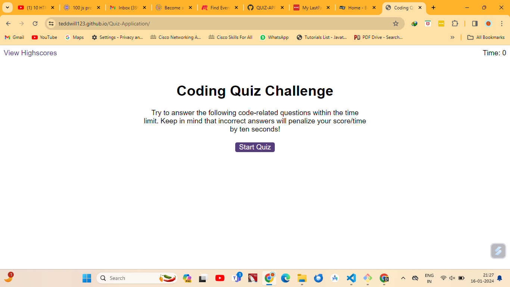
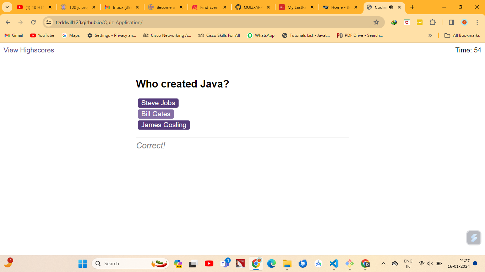
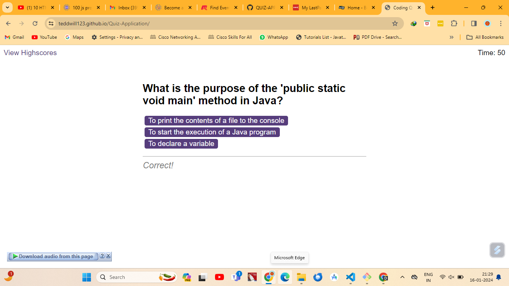

# Quiz-Application

## Introduction

This project is a web-based application that allows users to participate in a quiz and test their knowledge on various topics. It provides an interactive and engaging experience for users to answer multiple-choice questions and receive instant feedback on their performance.

## Features

Multiple-choice questions:
Score tracking
Highscores

## Technology Used

- HTML
- CSS
- JavaScript

## Installation

- Clone the repository:
    
    git clone https://github.com/teddwill123/Quiz-Application.git

## License

This project is licensed under the MIT License.

